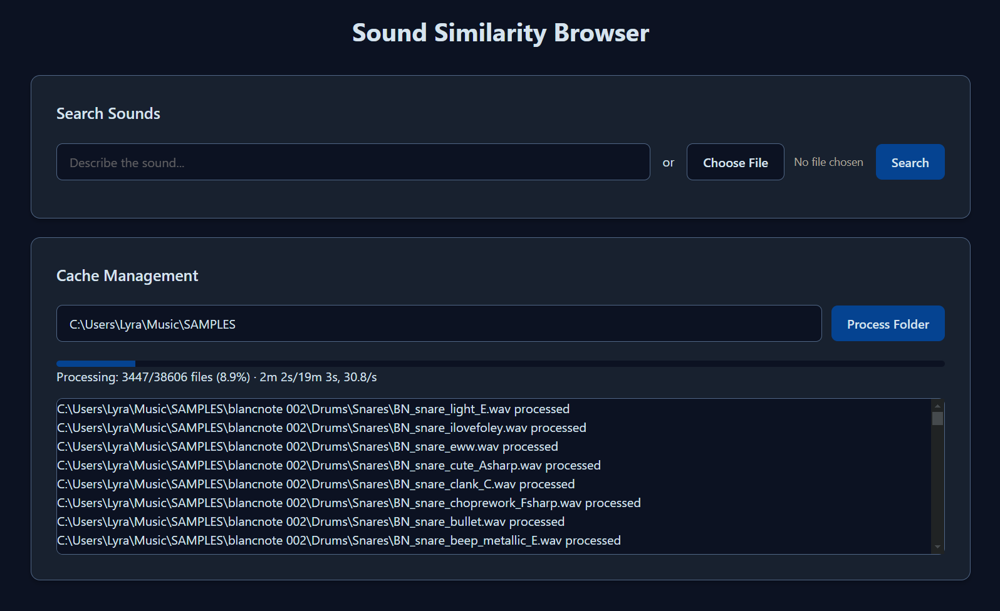

# sample-browser
sound-similarity sample browser via [CLAP](https://github.com/LAION-AI/CLAP) embeddings cosine distance

 requires ~4.2 GB VRAM to run (you will need a GPU)

## Install:

### For Windows users:
**download this repo, unzip it into a folder, and run `install.bat`.** you will need [CUDA](https://developer.nvidia.com/cuda-downloads?target_os=Windows&target_arch=x86_64) and python installed.

to run after first install, run `run.bat`. it will open localhost for you

code is multiplatform, but installer and run file are windows-only.

### For Mac users:
- Make sure Python 3.10 is installed (you can install it with homebrew)
    - `brew install python@3.10`
- Download this repo, unzip it into a folder
    - `git clone https://github.com/lyramakesmusic/sample-browser`
- Navigate to that folder in Terminal or your IDE
- Run `chmod +x install.sh`
- Then run `./install.sh`

To use after first install, run `./run.sh`

### Other OSs:
create a venv `python -m venv venv`, enter it `source venv/Scripts/activate`, run `pip install flask laion_clap librosa numpy torch`, make sure the CUDA version of torch is installed `pip install -U torch==2.4.0+cu121 torchvision torchaudio --index-url https://download.pytorch.org/whl/cu121`, then run `python sound-similarity-browser.py` and go to http://localhost:5000/

## Usage:

Paste a local filepath into the Cache Management input and press Process Folder. When complete, upload a sound or type a sound description and press search

