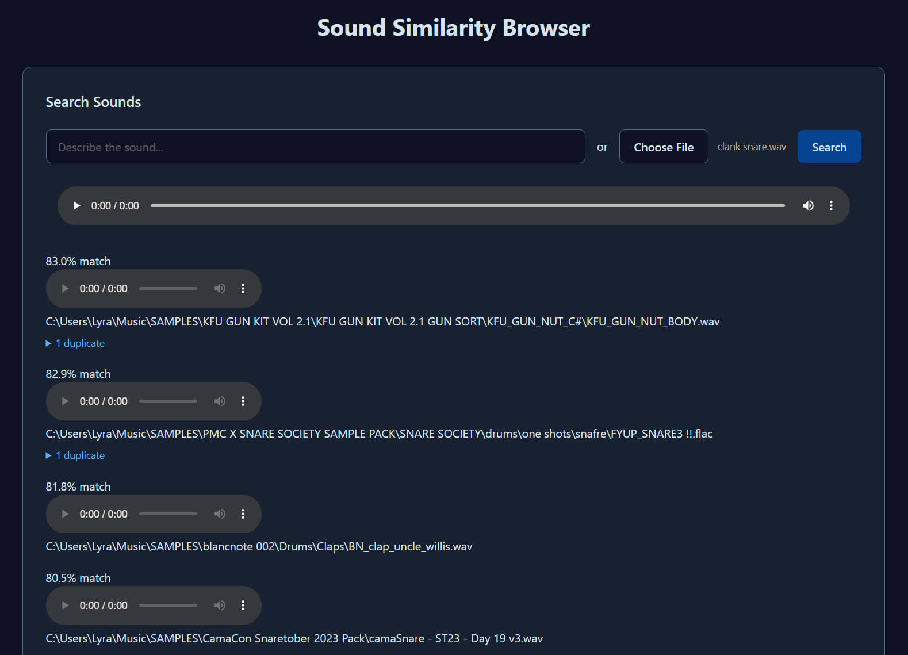
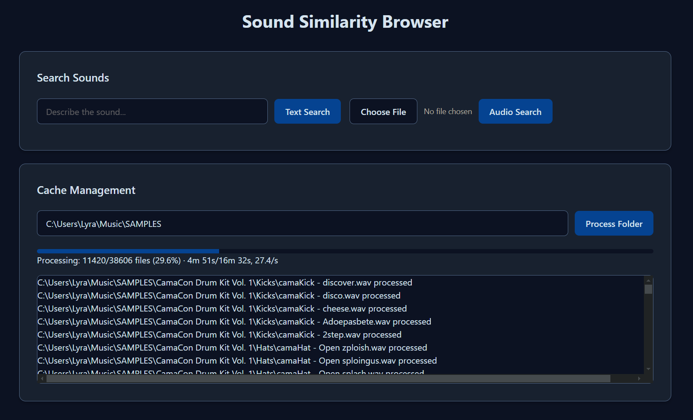

# sample-browser
sound-similarity sample browser via [clap](https://github.com/LAION-AI/CLAP)

currently windows-only: the code will run on other OSs, but the install and run scripts will need to be rewritten

### Install:

download this repo, unzip it into a folder, and run `install.bat`. you will need [CUDA](https://developer.nvidia.com/cuda-downloads?target_os=Windows&target_arch=x86_64) and python installed.

to run after first install, run `run.bat`. it will open localhost for you

### Usage:

Paste a local filepath into the Cache Management input and press Process Folder. When complete, upload a sound or type a sound description and press search

